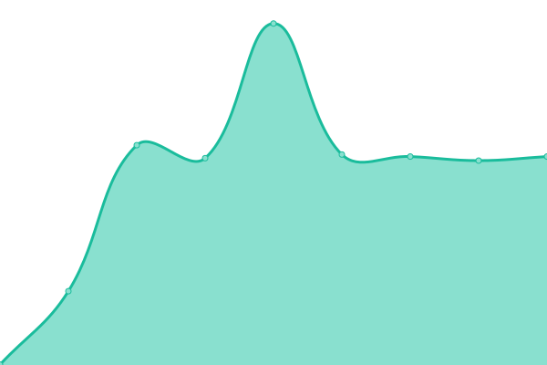
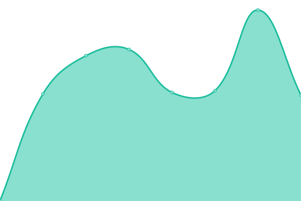
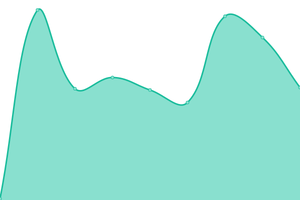
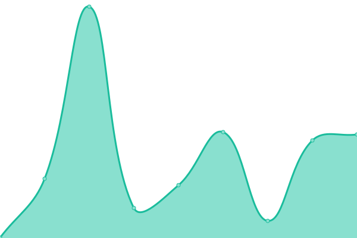
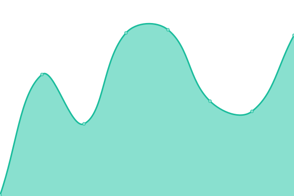

# [📈 Live Status](https://status.saladin.vn): <!--live status--> **🟧 Partial outage**

This repository contains the open-source uptime monitor and status page for [10X](https://status.saladin.vn), powered by [Upptime](https://github.com/upptime/upptime).

With [Upptime](https://upptime.js.org), you can get your own unlimited and free uptime monitor and status page, powered entirely by a GitHub repository. We use [Issues](https://github.com/tenxtenx/saladin-status/issues) as incident reports, [Actions](https://github.com/tenxtenx/saladin-status/actions) as uptime monitors, and [Pages](https://status.saladin.vn) for the status page.

<!--start: status pages-->
<!-- This summary is generated by Upptime (https://github.com/upptime/upptime) -->
<!-- Do not edit this manually, your changes will be overwritten -->
<!-- prettier-ignore -->
| URL | Status | History | Response Time | Uptime |
| --- | ------ | ------- | ------------- | ------ |
|  Backend API (Staging) | 🟩 Up | [backend-api-staging.yml](https://github.com/tenxtenx/saladin-status/commits/HEAD/history/backend-api-staging.yml) | 

 780ms
     
 | 

<a href="https://status.saladin.vn/history/backend-api-staging">99.64%</a>
    

|  Backend API (Production) | 🟩 Up | [backend-api-production.yml](https://github.com/tenxtenx/saladin-status/commits/HEAD/history/backend-api-production.yml) | 

 781ms
     
 | 

<a href="https://status.saladin.vn/history/backend-api-production">100.00%</a>
    

|  Utility API (Staging) | 🟥 Down | [utility-api-staging.yml](https://github.com/tenxtenx/saladin-status/commits/HEAD/history/utility-api-staging.yml) | 

 482ms
     
 | 

<a href="https://status.saladin.vn/history/utility-api-staging">0.00%</a>
    

|  Utility API (Production) | 🟩 Up | [utility-api-production.yml](https://github.com/tenxtenx/saladin-status/commits/HEAD/history/utility-api-production.yml) | 

 637ms
     
 | 

<a href="https://status.saladin.vn/history/utility-api-production">100.00%</a>
    

|  OCR API (Staging) | 🟩 Up | [ocr-api-staging.yml](https://github.com/tenxtenx/saladin-status/commits/HEAD/history/ocr-api-staging.yml) | 

 2486ms
     
 | 

<a href="https://status.saladin.vn/history/ocr-api-staging">100.00%</a>
    

|  OCR API (Production) | 🟥 Down | [ocr-api-production.yml](https://github.com/tenxtenx/saladin-status/commits/HEAD/history/ocr-api-production.yml) | 

 0ms
     
 | 

<a href="https://status.saladin.vn/history/ocr-api-production">0.00%</a>
    

|  CMS | 🟥 Down | [cms.yml](https://github.com/tenxtenx/saladin-status/commits/HEAD/history/cms.yml) | 

 782ms
     
 | 

<a href="https://status.saladin.vn/history/cms">14.49%</a>
    

|  Mass Biker (Staging) | 🟩 Up | [mass-biker-staging.yml](https://github.com/tenxtenx/saladin-status/commits/HEAD/history/mass-biker-staging.yml) | 

 106ms
     
 | 

<a href="https://status.saladin.vn/history/mass-biker-staging">100.00%</a>
    

|  Mass Biker (Production) | 🟩 Up | [mass-biker-production.yml](https://github.com/tenxtenx/saladin-status/commits/HEAD/history/mass-biker-production.yml) | 

 229ms
     
 | 

<a href="https://status.saladin.vn/history/mass-biker-production">100.00%</a>
    

|  Admin Dashboard (Staging) | 🟩 Up | [admin-dashboard-staging.yml](https://github.com/tenxtenx/saladin-status/commits/HEAD/history/admin-dashboard-staging.yml) | 

 150ms
     
 | 

<a href="https://status.saladin.vn/history/admin-dashboard-staging">100.00%</a>
    

|  Admin Dashboard (Production) | 🟩 Up | [admin-dashboard-production.yml](https://github.com/tenxtenx/saladin-status/commits/HEAD/history/admin-dashboard-production.yml) | 

 198ms
     
 | 

<a href="https://status.saladin.vn/history/admin-dashboard-production">100.00%</a>
    

|  Promotion Tool (Staging) | 🟥 Down | [promotion-tool-staging.yml](https://github.com/tenxtenx/saladin-status/commits/HEAD/history/promotion-tool-staging.yml) | 

 0ms
     
 | 

<a href="https://status.saladin.vn/history/promotion-tool-staging">0.00%</a>
    

|  Promotion Tool (Production) | 🟥 Down | [promotion-tool-production.yml](https://github.com/tenxtenx/saladin-status/commits/HEAD/history/promotion-tool-production.yml) | 

 0ms
     
 | 

<a href="https://status.saladin.vn/history/promotion-tool-production">0.00%</a>
    

<!--end: status pages-->

[**Visit our status website →**](https://status.saladin.vn)

## 📄 License

- Powered by: [Upptime](https://github.com/upptime/upptime)
- Code: [MIT](./LICENSE) © [10X](https://status.saladin.vn)
- Data in the `./history` directory: [Open Database License](https://opendatacommons.org/licenses/odbl/1-0/)
